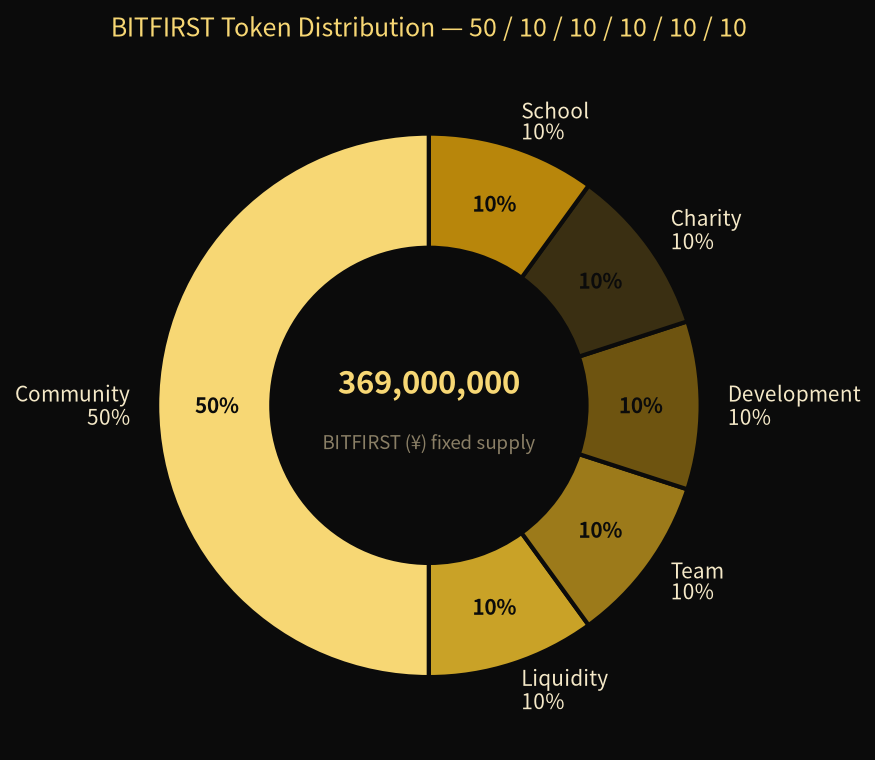
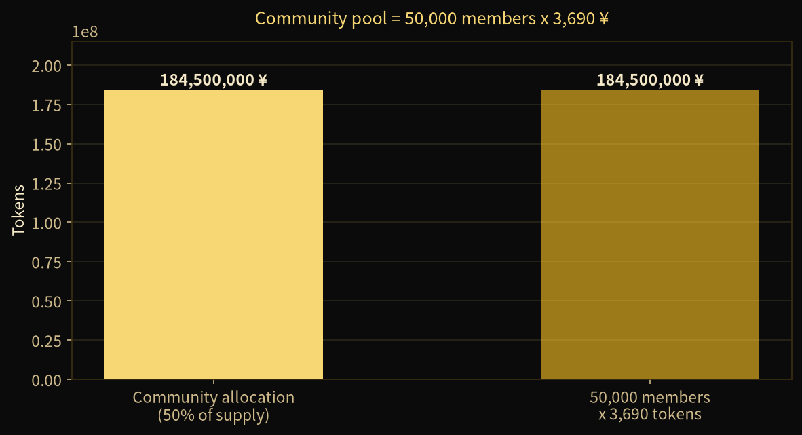
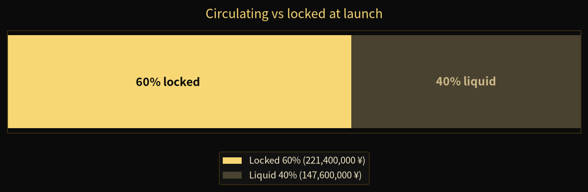
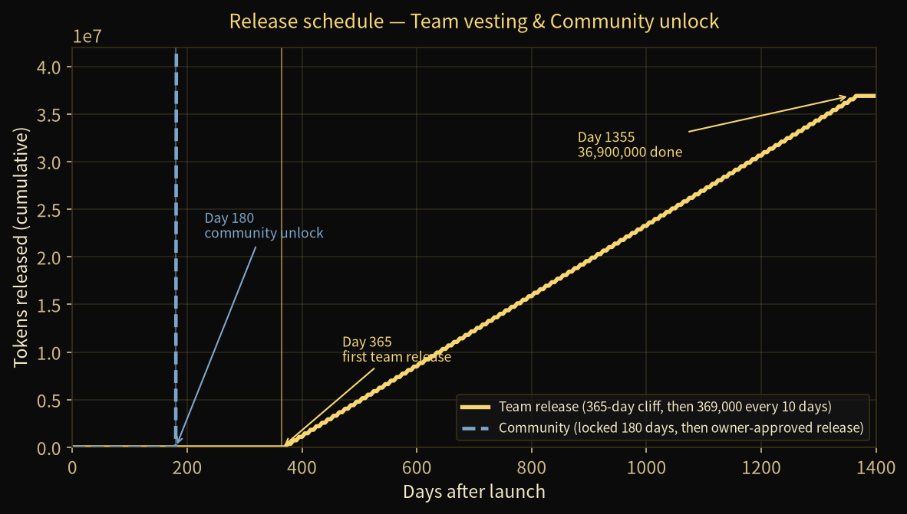

<div align="center">



# BITFIRST (¥)

**A community-first fixed-supply token on BNB Smart Chain (BEP-20)**


**Status: pre-launch.** The contract is written and tested on a local EVM. It has
**not** been deployed to mainnet, not verified on BscScan, and not audited.

</div>

---

## What this is

BITFIRST is a **fixed-supply** BEP-20 token with **no owner mint, no pause, no
blacklist and no transfer tax**. The full supply is minted once in the
constructor and split across six wallets. Two of those wallets are contracts
that lock their tokens so the release schedule is visible on-chain and cannot
be changed later.

| | |
|---|---|
| **Name** | BITFIRST |
| **Symbol** | `¥` (U+00A5 — a non-ASCII symbol, so the source uses `unicode"¥"`) |
| **Total supply** | 369,000,000 (fixed, immutable) |
| **Decimals** | 18 |
| **Chain** | BNB Smart Chain, chain ID 56 (testnet 97) |
| **Compiler** | solc 0.8.24, optimizer on, 200 runs, MIT |
| **Imports** | none — a single self-contained file, easy to verify on BscScan |

---

## Tokenomics — 50 / 10 / 10 / 10 / 10 / 10


| Bucket | Share | Tokens | At launch | Release rule |
|---|---:|---:|---|---|
| **Community** | 50% | **184,500,000** | 🔒 locked | 180-day lock; after day 180 released **only with owner approval** (`OwnerReleaseVault`) |
| **Liquidity** | 10% | 36,900,000 | open | goes into the PancakeSwap pool |
| **Team** | 10% | 36,900,000 | 🔒 locked | 365-day cliff, then **369,000 every 10 days** (`TeamVesting`) |
| **Development** | 10% | 36,900,000 | open | owner-held, for building |
| **Charity** | 10% | 36,900,000 | open | charity wallet, no sale before 6 months |
| **School** | 10% | 36,900,000 | open | school wallet for poor children, no sale before 6 months |
| **Total** | **100%** | **369,000,000** | **60% locked** | 40% liquid at launch |

**Community pool = 50,000 members × 3,690 ¥ = 184,500,000 ¥** ✔️





---

## Release schedule (verified arithmetic)



| Point in time | Team released (cumulative) | Community status |
|---|---:|---|
| Day 0 | 0 | locked |
| Day 179 | 0 | locked — `Vault: still locked (180 days)` |
| Day 180 | 0 | lock ends, but claim needs **owner approval** |
| Day 365 | 369,000 (first release) | unlocked by approval |
| Day 1355 | **36,900,000 (100 releases done)** | — |

100 team releases × 369,000 = 36,900,000 exactly. Nothing rounds off.

---

## Repository layout

```
.
├── app/                        # the offline member app (PWA) — this is the site
│   ├── index.html              # single self-contained file
│   ├── manifest.json           # installable app manifest
│   ├── sw.js                   # service worker → works offline
│   ├── icon-192.png
│   ├── icon-512.png
│   └── .well-known/assetlinks.json   # for the Android (TWA) build
├── contracts/
│   ├── BITFIRST.sol            # the token
│   ├── CommunityLock.sol       # 180-day lock + owner-approved release
│   └── TeamVesting.sol         # 365-day cliff + 1% every 10 days
├── docs/
│   ├── BITFIRST-Tokenomics-Master.xlsx   # 5-sheet model with live formulas
│   ├── whitepaper.pdf
│   ├── landing.html
│   └── chart-*.png
├── scripts/
│   └── deploy.md               # step-by-step deploy notes
├── netlify.toml                # Netlify one-click deploy from this repo
├── .github/workflows/pages.yml # GitHub Pages deploy of /app
├── LICENSE
└── README.md
```

---

## The member app

`app/index.html` is one self-contained 70 KB file. It needs **no server, no
internet, no email and no fee** — all data stays in the phone's `localStorage`.

What it does:

* **Grand Welcome** landing screen describing the project
* **Owner login:** username `Owner` (or `0`)
* **Member registration** → owner approves → member gets **3,690 ¥**
* **"Save my username on this phone"** option
* **Forgot password?** flow using a security question (no email needed)
* show/hide 👁 toggle on every password box
* no hard-coded password — the owner sets it on first run, stored only as a hash

**Run it locally:** open `app/index.html` in any browser. That's it.

**Run it as a website:**

* **Netlify** — connect this repo; `netlify.toml` already points the publish
  directory at `app/`. Or drag-drop the `app/` folder onto app.netlify.com/drop.
* **GitHub Pages** — enable Pages → Source: *GitHub Actions*. The included
  workflow publishes `app/` for you.

---

## Deploy the token (testnet first, free)

1. Open [Remix](https://remix.ethereum.org), paste `contracts/BITFIRST.sol`.
2. Compiler **0.8.24**, optimizer **enabled, 200 runs**.
3. Environment: **Injected Provider (MetaMask)** → **BSC Testnet** (chain 97).
4. Constructor arguments, in this order — six **different** wallets:
   `communityLock, liquidityWallet, teamVesting, developmentWallet, schoolWallet, charityWallet`
   The constructor rejects duplicates and zero addresses.
5. For verification on BscScan: single file, no imports, MIT, optimizer 200 runs.

> Never put a private key or seed phrase into any website or chat, including
> this app — it rejects such input on purpose.

---

## Honest status

**Done:** tokenomics frozen, contracts written and tested on a local chain,
member app built and tested in a real browser, tokenomics model with live
formulas, charts.

**Not done:** BscScan testnet deploy, mainnet deploy, BscScan verification,
liquidity pool, security audit, legal review, exchange listings.

**Not promised:** any price, any profit, any listing. Nothing in this repo is
financial or legal advice, and nothing here is an offer to sell a token. Minting
a token does not make it valuable — liquidity and demand do that, or don't.

---

## Licence

MIT — see [LICENSE](LICENSE). Applies to the code only.
